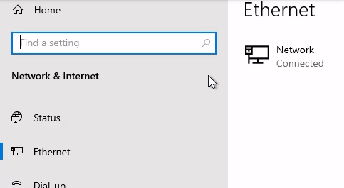
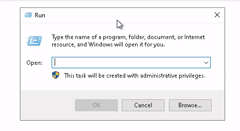
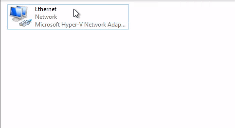
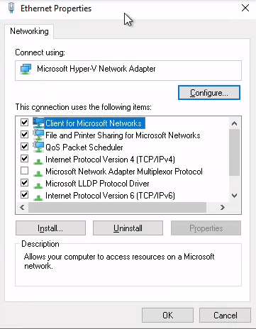
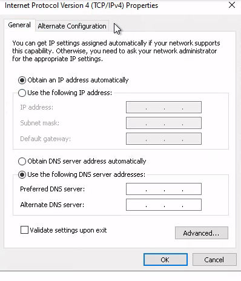
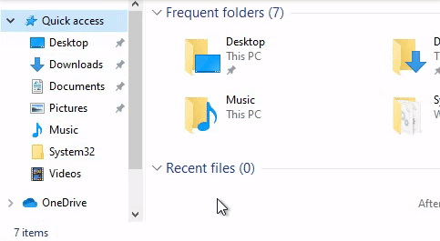

<h1 align="center">:zap: Windows P2P File Sharing :zap:</h1>

- - -

### :large_blue_diamond: **Command Line**
Note: Done By Reading The Documentation And Learning The Command Line Not A Random Guide On The Internet

##

### :small_orange_diamond:**Set Network Profile To Private**
```shell
Set-NetConnectionProfile -InterfaceAlias Ethernet -NetworkCategory "Private"
```

##

### :small_orange_diamond:**Set Network IPs**
```shell
fsdfsdfsdfsdfsdfsdf
```

##

### :small_orange_diamond:**Enable Network Discovery On Private Network & Disable on Public**
```shell
Get-NetFirewallProfile -Name Private | Get-NetFirewallRule | ? DisplayGroup -like 'Network Discovery' | Enable-NetFirewallRule

Get-NetFirewallProfile -Name Public | Get-NetFirewallRule | ? DisplayGroup -like 'Network Discovery' | Disable-NetFirewallRule
```
##

### :small_orange_diamond:**Enable File Sharing On Private Network & Disable on Public**
```shell
Get-NetFirewallRule | ? DisplayGroup  -like 'File and Printer Sharing' | ? Profile -like 'Private, Public' | Set-NetFirewallRule -Profile Private

Get-NetFirewallProfile -Name Private | Get-NetFirewallRule | ? DisplayGroup -like 'File and Printer Sharing' | Enable-NetFirewallRule
#Qual a diferenca entre File sharing over smbdirect and not
Get-NetFirewallProfile -Name Public | Get-NetFirewallRule | ? DisplayGroup -like 'File and Printer Sharing' | Disable-NetFirewallRule
```

- - -

### :large_blue_diamond: **GUI**

##

### :small_orange_diamond:**Set Network To Private**

**Settings -> Network & Internet -> Ethernet -> Network -> Private**



##

### :small_orange_diamond:**Set Network IPs**
**Windows Key + R -> ncpa.cpl & Enter -> Right Click The Network Adapter & Go To Properties -> Properties -> Double Click 'Internet Protocol Version 4(TCP/IPV4)' -> Use The Following IP Adress**







##

### :small_orange_diamond:Enable Network Discovery
**File Explorer -> Network -> Click Yellow Prompt -> Turn On Network Discovery And File Sharing**



##

---
